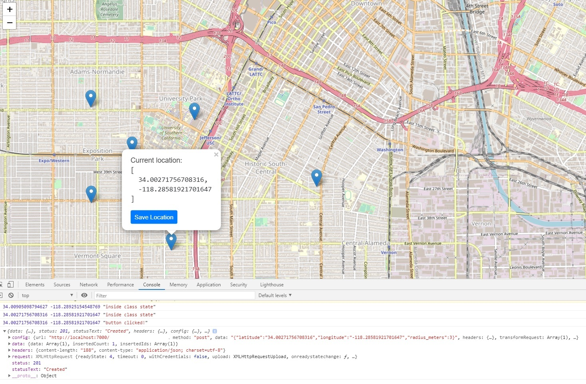
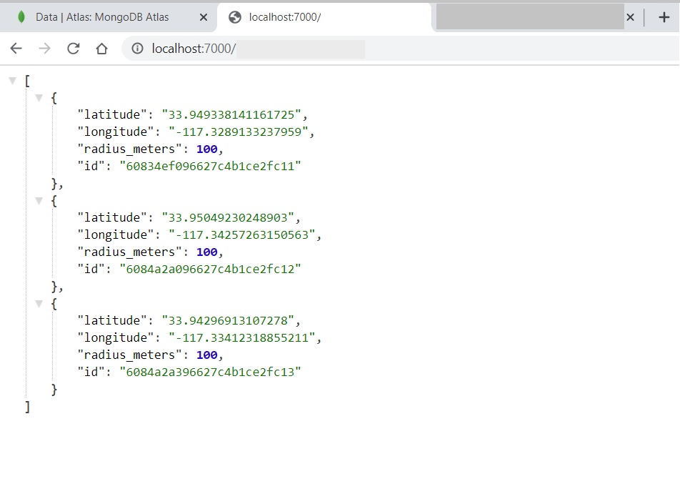
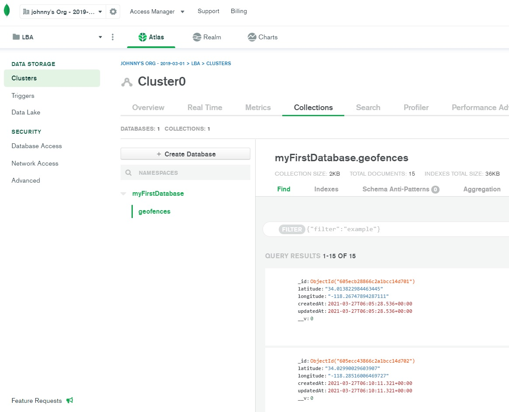

# React Leaflet Map Picker

I used React, Typescript, Node.js, Express.js, and MongoDB to develop a new full-stack map picker web application that allows users to pick a location to get latitude and longitude, integrate with RESTful APIs, then save them into the database.

## Available Scripts

In the project directory, you can run:

### `npm start`

Runs the app in the development mode.\
Open [http://localhost:3000](http://localhost:3000) to view it in the browser.
